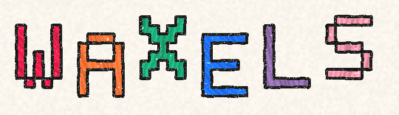
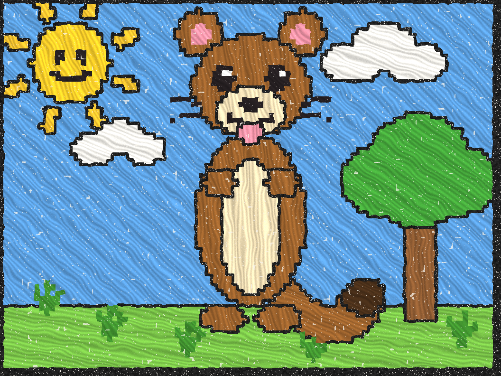
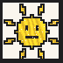
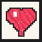

<p align="center">
  
</p>

<p align="center"><b>wax + pixels. crayon art, melted permanently into Solana.</b></p>

<p align="center">
  <a href="https://x.com/WaxelsProtocol">𝕏 @WaxelsProtocol</a> ·
  <a href="#-quickstart">quickstart</a> ·
  <a href="#-how-it-works">how it works</a> ·
  <a href="#-the-waxel-token">$WAXEL</a> ·
  <a href="LICENSE">MIT</a>
</p>

<p align="center">
  
</p>

<p align="center"><i>this exact drawing is 3,082 bytes and lives inside a Solana account.<br/>
not a link to it. not a hash of it. <b>the drawing.</b></i></p>

---

## 🖍️ what is waxels?

When you were five, you drew something great and it went on the fridge.

**Waxels is the fridge, except the fridge is Solana and the drawing can never
be thrown away.** Every waxel is a small image — up to 4,096 bytes — whose
actual pixels are stored *inside its own account on the Solana blockchain*.
Once the artist **seals the wax**, no instruction in the program can ever
touch those bytes again. Not us, not you, not anyone. It's immutable, forever,
on chain.

## 🤔 wait — aren't NFTs already "on the blockchain"?

Here's the industry's little secret: **mostly, no.**

A typical NFT on Solana (and Ethereum, and everywhere else) is a tiny record
that says *"the image is over there"* — a URL pointing at IPFS, Arweave, or
somebody's web server. The chain stores the *pointer*. The picture lives
somewhere else, kept alive by pinning services, gateways, and monthly bills.

| | regular NFT | waxel |
|---|---|---|
| what's on chain | a URL | **the image itself** |
| if IPFS unpins it | 🪦 broken image | still there |
| if the startup dies | 🪦 broken image | still there |
| if the gateway 404s | 🪦 broken image | still there |
| in 100 years | good luck | **still there** |

If Solana is running, your waxel renders. That's the whole dependency list.

## ⚡ what changed: SIMD-0385

Solana transactions were capped at **1,232 bytes** since genesis — room for a
pointer, never a picture. [SIMD-0385 v1 transactions](https://github.com/solana-foundation/transaction-v1-examples)
raise that to **4,096 bytes**.

4 KB sounds small until you remember what pixel art can do with it. The entire
scene at the top of this README — weasel, smiley sun, tree, clouds, lawn — is
**3,082 bytes** as an indexed-color PNG. Which means for the first time ever:

> **mint → upload the whole image → seal it forever, in ONE transaction.**

No upload ceremonies. No 47-transaction inscription marathons. One signature,
one slot, permanent art.

From a real run on our local validator (Agave 4.2, feature gate
`txv1aq4pp281K9um3tnPgkfX8UqtFT6wcVW3hNezGLL` active):

```
🖍️  minting waxel the weasel — the whole image in ONE v1 transaction
  ✓ mint+scribble+seal "waxel the weasel" in ONE transaction — v1 tx, 3418 bytes on the wire

🖍️  proving the bytes survived
  minted file:  38ebf2f985ae555e734fe245773fe84b9ffb75758a05cfc75afda864b60ccc94
  chain bytes:  38ebf2f985ae555e734fe245773fe84b9ffb75758a05cfc75afda864b60ccc94
  ✓ identical. the drawing IS the account.
```

## 🧸 the protocol

Five instructions. Named the way a five-year-old would name them, because
that's the correct way.

| instruction | what it does |
|---|---|
| `mint` | pin a fresh 4,096-byte canvas to the fridge |
| `scribble` | crayon bytes onto it (whole image in one go on v1 txs) |
| `seal` | melt the wax. **the image is now immutable forever** |
| `give` | hand your drawing to a friend (ownership transfer) |
| `set_pfp` | hang it on the fridge door — an on-chain pfp registry any app can read |

Plus `wipe` (start over, *before* sealing) and `plug_in_fridge` (one-time
protocol init — no admin keys, the "curator" is purely decorative).

A wallet's pfp resolves with one PDA lookup: `["pfp", wallet]` → waxel →
pixels. No metadata server. No image CDN. Wallets and explorers can render
profile pictures straight from account data.

## 🚀 quickstart

You need: Rust, Node 22+, [Agave 4.2+](https://github.com/anza-xyz/agave)
(`agave-install init v4.2.0`), and Anchor v2
(`cargo install --git https://github.com/otter-sec/anchor.git --branch anchor-next anchor-cli`).

```bash
git clone https://github.com/MidTermDev/waxels && cd waxels

anchor build && cargo test        # build the program + full lifecycle tests
node art/build.mjs                # draw the crayon art (deterministic!)
./scripts/localnet.sh start       # local validator, v1 txs live from slot 0
./scripts/demo.sh                 # the whole story, end to end
```

The demo deploys the program, plugs in the fridge, mints **waxel the weasel**
in one v1 transaction, mints a fridge gallery (`sunny day`, `for mom`,
`to the moon`), hangs a pfp, then reads every byte back out of the chain and
proves the sha256 matches the file it minted. Then draw your own:

```bash
cd client
npx tsx src/cli.ts mint my-drawing.png --name "my masterpiece"
npx tsx src/cli.ts show --name "my masterpiece" --out roundtrip.png
npx tsx src/cli.ts pfp  --name "my masterpiece"
```

## 🎨 the art

Everything you see here was rendered by [`art/build.mjs`](art/build.mjs) — a
zero-dependency crayon engine that draws coloring-book outlines, waxy
directional strokes, and paper grain, then hand-encodes PNGs (4-bit indexed
when every byte counts). Same seed, same drawing, every time.

| | | |
|:---:|:---:|:---:|
|  |  |  |
| `sunny day` — 671 bytes | `for mom` — 613 bytes | `to the moon` — 622 bytes |

## 🪙 the WAXEL token

```
38ZUxkPYsbpUs8jesMNZfiFZrjTMfLtzaJe8qC5WAXEL
```

**$WAXEL** is the protocol token. With the mainnet release it ships
**interswapability between NFT and token** — 404-style: melt a waxel into
fungible $WAXEL, or crystallize $WAXEL back into a waxel. Your art and your
tokens become two states of the same wax.

## 🗺️ roadmap

- [x] program: mint / scribble / seal / give / set_pfp, full test suite
- [x] one-transaction mints on a SIMD-0385 localnet (Agave 4.2)
- [x] crayon art engine + the fridge gallery
- [x] TypeScript client speaking real v1 transactions
- [ ] **mainnet, the moment v1 transactions activate** — the program is
      built against the real feature gate; when
      `txv1aq4pp281K9um3tnPgkfX8UqtFT6wcVW3hNezGLL` goes live, we ship
- [ ] $WAXEL ↔ waxel interswap (404-style) at mainnet release
- [ ] open fridge: public gallery of every sealed waxel

## ❓ faq

**Is 4 KB really enough for art?**
The banner weasel is 3,082 bytes. Every sprite you loved before 1995 was
smaller than that. Constraints are the art form.

**Can a sealed waxel really never change?**
Really. `scribble` and `wipe` hard-fail on sealed waxels, and no other
instruction writes to the image. The account is owned by the program, and the
program has no path that mutates sealed bytes. That's the entire point.

**Who runs the servers?**
There are no servers. That's the other entire point.

**Why "waxels"?**
wax + pixels. also it sounds like weasel. we have a weasel.

---

<p align="center">
  <br/>
  <i>made with 🖍️ by <a href="https://github.com/MidTermDev">midtermdev</a> ·
  follow <a href="https://x.com/WaxelsProtocol">@WaxelsProtocol</a></i>
</p>
